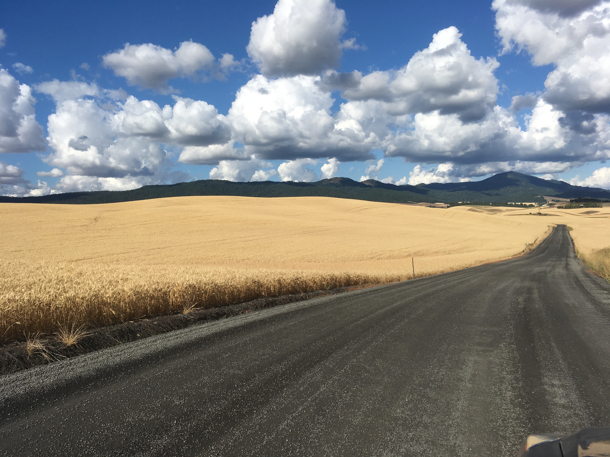

```{r setup, include=FALSE}
knitr::opts_chunk$set(echo = TRUE)
```

Sorry for being boring here! I am in the process of building a personal website so am using some of that material here.



* **Fishers' response to temperature change reveals the importance of integrating human behavior in climate change analysis.** Fiorella, K.J. Bageant, E., Schwartz, N.B., Thilsted, S.H., Barrett, C.B. *Science Advances.* Forthcoming.

* **Food price volatility and household food security: Evidence from Nigeria.** Amolegbe, K.B., Upton, J.U., Bageant, E., Blom, S. *Food Security*. Forthcoming. 

* **Empowerment and Nutrition in Niger: Insights from the Women’s Empowerment in Nutrition Grid**. Lentz, E., Bageant, E., & Narayanan, S. *Food Security.* Forthcoming.

* [**Analyzing drivers of fish biomass and biodiversity within community fish refuges in Cambodia**](https://www.ecologyandsociety.org/vol24/iss3/art18/). Fiorella, Fiorella, K.J., Bageant, E., Kim, M., Sean, V., Try, V., MacDonell, H., Baran, E., Kura, Y., Brooks, A., Barrett, C.B., Thilsted, S. *Ecology and Society*. September 2019.

* [**Implications of climate change for freshwater fisheries in Cambodia’s rice field fisheries: a longitudinal cohort study**](https://www.thelancet.com/journals/lanplh/article/PIIS2542-5196(18)30108-6/fulltext) Fiorella, KJ, Bageant, ER, Ordonez, KA, Kim, M, Kura, Y, Thilsted, S, Barrett, CB. . *Lancet Planetary Health: Best Abstracts in Planetary Health*. 2018.

* [**Are There Gender Differences in Demand for Index-Based Livestock Insurance?**](http://www.tandfonline.com/doi/full/10.1080/00220388.2016.1214717) Bageant, E.B & Barrett, C.B., *Journal of Development Studies*. 2017.

* [**Agriculture-Nutrition Linkages and Child Health in the Presence of Conflict in Nepal**](http://ebrary.ifpri.org/utils/getfile/collection/p15738coll2/id/130219/filename/130430.pdf) Bageant, E., Liu, Y., Diao, X. *IFPRI Discussion Paper*. March 2016.

* [**Food Aid and Agricultural Cargo Preference**](http://barrett.dyson.cornell.edu/Papers/Cargo_Preference_Final_For_Typesetting.pdf). Bageant, E., Barrett, C.B., Lentz, E.. *Applied Economic Perspectives and Policy*. 2010.

